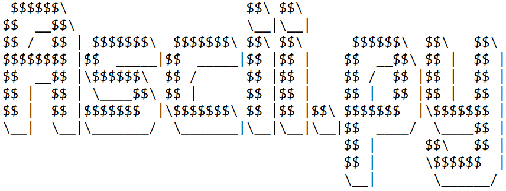

.. Asciin.py documentation master file, created by

   sphinx-quickstart on Sat Aug  7 15:27:30 2021.

**Asciin.py** is a 2D and 3D Ascii game engine written for performance.

.. note::
   This project is under active development.

Indices and tables
==================

* :ref:`genindex`
* :ref:`modindex`
* :ref:`search`

.. toctree::
   :maxdepth: 2
   :caption: Contents:

   ./quickstart.rst
   ./basics.rst
   ./api.rst
   ./events.rst

