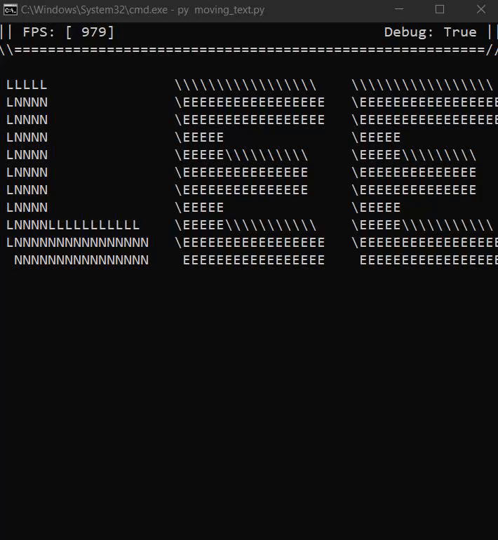
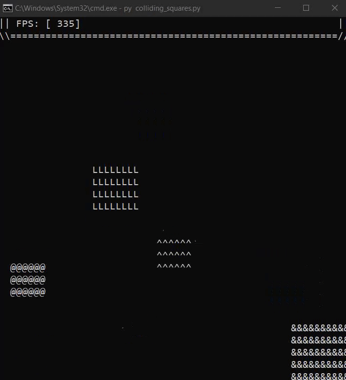

# PyAscii

A 2D and 3D Ascii game engine written for performance (still under development and nowhere near ready for use without extensive knowledge).
LuckyDevStuff_render.gif

### Status Demo

1. **Matrixes Patterns**
     Great example in working with PixelPainters.

2. **Moving Text**
    
   ~ demonstrates simple movement.
   See code [here](https://github.com/Rickaym/PyAscii/tree/main/examples/moving_text.py).

3. **Colliding Squares**
    
   ~ demonstrates the collision physics by utilizing mechanisms built into PyAscii.
   See code [here](https://github.com/Rickaym/PyAscii/tree/main/examples/colliding_squares.py).

Contact me at Neo#1844 for inquiries.
